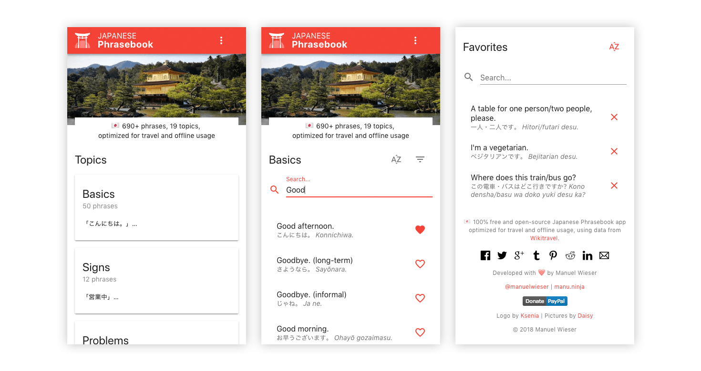

# Japanese Phrasebook

⛩ 100% free Japanese Phrasebook app, built for travel and offline usage. Add it to your Home screen and access 670+ essential phrases in 19 topics. Requires no Internet connection and offers speech synthesis, so you know how to pronounce Japanese phrases correctly.

[Introducing “Japanese Phrasebook”](https://manu.ninja/introducing-japanese-phrasebook)

## Contributors

Manuel Wieser 
<https://manu.ninja> 
<https://twitter.com/manuelwieser> 
<https://www.paypal.me/manuninja> 

Logo by Ksenia 
<https://steemit.com/@happyksu>

Pictures by Daisy 
<https://www.instagram.com/daisimerollin/>

Data from Wikitravel 
<https://wikitravel.org/en/Japanese_phrasebook>
